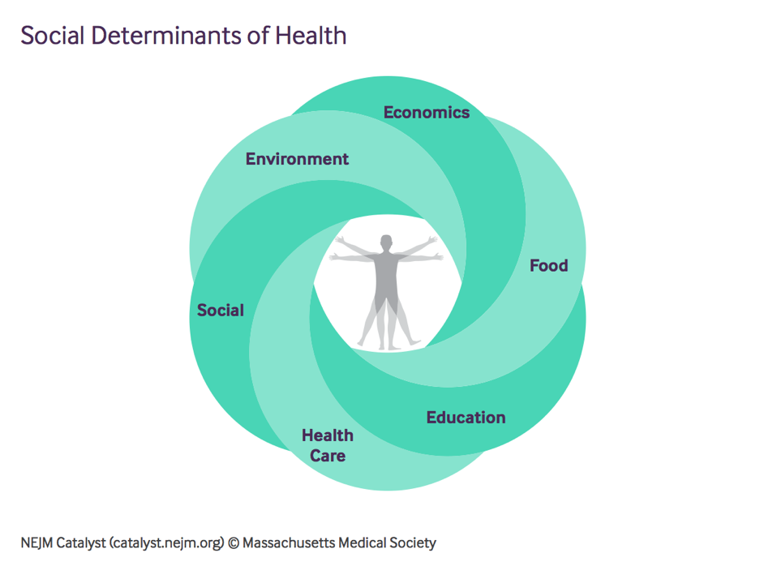

```{r setup, include=FALSE}
knitr::opts_chunk$set(echo = FALSE, warning = FALSE, message = FALSE)
```

```{r library}
library(flexdashboard)
library(shiny)
library(tidyverse)
library(readxl)
library(lubridate)
library(plotly)
library(ggthemes)
library(gridExtra)
library(ggmap)
library(broom)
library(kableExtra)
```


```{r read-data, include=FALSE}
edu_raw <- read_csv(here::here("data/dsh_simple.csv"))
commodity_raw <-  read_excel(here::here("data/CMOHistoricalDataMonthly.xlsx"), sheet = "Monthly Indices", col_types = c("text", rep("numeric", 15)))
gender<- read_csv(here::here("data/GH5050 Covid-19 sex-disaggregated data tracker.csv"))
confirmed_cases <- read_csv(here::here("data/time_series_covid19_confirmed_global_iso3_regions.csv"))
deaths1 <- read_csv(here::here("data/time_series_covid19_deaths_global_iso3_regions.csv"))
recovery_cases <- read_csv(here::here("data/time_series_covid19_recovered_global_iso3_regions.csv"))
daily_cases <- read_csv(here::here("data/WHO-COVID-19-global-data.csv"))
health_raw <- read_csv(here::here("data/NHA_indicators.csv"))
confirmed <- read_csv(here::here("data/time_series_covid19_confirmed_global.csv"))
deaths <- read_csv(here::here("data/time_series_covid19_deaths_global.csv"))
recovered <- read_csv(here::here("data/time_series_covid19_recovered_global.csv"))
income_group <- read_csv(here::here("data/AllData.csv"))
df <- read_csv(here::here("data/df.csv"))
```

Introduction
=============================
Column 
--------------------------------------------------------------------------
### Cover Photo


Column 
--------------------------------------------------------------------------
### Overview

The world we live in today is far different than it was 3 months ago. The cataclysmic effects of the coronavirus pandemic has not only affected our lifestyle, but it has created compounded effects in many sectors of our world. Our interest in this problem is that we know it has impacted the world, but just how severe are these problems? We have focused our analysis on 5 different aspects:   

- Society  
- Gender  
- Commodity Markets  
- Education  
- Healthcare Expenditure  

Our motivation to focus our research on COVID-19 is to understand how it has impacted the lives of those in different countries. As we live in Australia, we are fortunate and lucky enough to not have devastating effects or severe lockdown restrictions. This is not true for other countries, but most importantly, the impact on society is far more shocking in other countries. Additionally, trying to get a grasp on how the commodity markets have fluctuated is a key interest of ours as we want to visualize the impact that a virus can have on trade and globalization. Furthermore, we seeked to learn more about a country's severity of COVID-19 cases by looking into their healthcare expenditure and income levels. Lastly, understanding how education institutions have been affected as well as males and females fueled our interest further to do this research.  

__Data limitations: __   

- Some countries that have been impacted by COVID-19 are not included in our dataset.  
- The dataset showcasing the number of new cases and deaths has reported some negative values for the number of cases and the number of deaths reported in the US. Only one such row had these negative values. It has impacted my analysis especially on the linear modelling section, as my model uses the number of new cases to predict the number of new deaths. To counter this, I used the absolute value of these results, as a result, this may impact the results and analysis on the linear model albeit in a small way.   
- The last reported date of cases, deaths and recovered cases by countries are not always the same.- The number of cases and deaths in some countries may be under-reported, which will eventually reduce the accuracy of the entire data set. The situation occurs more in low-income countries. While country circumstances will differ, inequality results play a significant role in limitations (Schellekens & Sourrouille, 2020).  
- The latest data available on health expenditure is in 2017. But the COVID-19 breakout occurred in 2019. Although there’s a policy lag in the impact of health spending, there may be few countries that have seen significant changes in health spending over the prior two years. This is not reflected in our data, which could lead to inaccuracies in the analysis.

__All our data are sourced from:__  

- The Humanitarian Data Exchange  
- The World Health Organization  
- The World Bank  
- Global Health 5050  

Methodology
============================

Our analysis focuses on these research questions:  

1) How has COVID-19 impacted the world through cases, deaths and recovery cases?   
2) How are cases differentiated by gender?   
3) What are the effects of COVID-19 on the commodity markets?  
4) What is the impact of school closures on education?  
5) Explore whether there is a relationship between death rates, recovery rates and the health expenditure and income level of a country.

Data tidying method to clean our datasets consisted of:   

- Using the read_excel and read_csv function to read in various .xlsx and .csv files.  
- Renaming certain attributes to make them more meaningful.  
- Narrowing down the dataset by using the pivot_longer function to reduce the number of columns.  
- Widening the dataset by using the pivot_wider function.  
- Converting the date column into the appropriate date format.  
- Grouping by countries and a certain date.  
- Summarising the values to get the cumulative confirmed cases, deaths and recovered cases for each country.  
- Using a map function to read in a map of the world to make visualizations and compare different scenarios between countries.  

Data cleaning code {data-navmenu="Data and Data cleaning"}
========================

Column {.tabset}
------------------------------
### Confirmed Cases
```{r, echo=TRUE}
confirmed_cases2 <- confirmed_cases[-1, -c(1,3,4,129,131,132,133,134)] 
```

```{r, echo=TRUE}
confirmed_cases3 <- confirmed_cases2 %>% 
                    rename(Country = `Country/Region`, 
                            ISO_Code = `ISO 3166-1 Alpha 3-Codes`, 
                            Continent = `Region Name`) %>% 
                    pivot_longer(cols = c("1/22/20":"5/23/20"), 
                                  names_to = "Date", 
                                  values_to = "Cumulative_Cases") %>%
                    mutate(Date = mdy(Date))
```

```{r, echo=TRUE}
confirm_final <- confirmed_cases3 %>% 
                  group_by(Country) %>% 
                  filter(Date == "2020-05-23") %>% 
                  summarise(Cumulative_Cases = sum(Cumulative_Cases))
```

### Death Cases

```{r, echo=TRUE}
deaths2 <- deaths1[-1, -c(1,3,4,129,131,132,133,134)]
```

```{r, echo=TRUE}
deaths3 <- deaths2 %>% 
           rename(Country = `Country/Region`, 
                            ISO_Code = `ISO 3166-1 Alpha 3-Codes`, 
                            Continent = `Region Name`) %>% 
                    pivot_longer(cols = c("1/22/20":"5/23/20"), 
                                  names_to = "Date", 
                                  values_to = "Cumulative_Deaths") %>%
                    mutate(Date = mdy(Date))
```

```{r, echo=TRUE}
deaths_final <- deaths3 %>% 
                group_by(Country) %>% 
                filter(Date == "2020-05-23") %>% 
                summarise(Cumulative_Deaths = sum(Cumulative_Deaths))
```

### Recovered Cases

```{r, echo=TRUE}
recovery_cases2 <- recovery_cases[-1, -c(1,3,4,129,131,132,133,134)]
```

```{r, echo=TRUE}
recovery_cases3 <- recovery_cases2 %>% 
                   rename(Country = `Country/Region`, 
                            ISO_Code = `ISO 3166-1 Alpha 3-Codes`, 
                            Continent = `Region Name`) %>% 
                    pivot_longer(cols = c("1/22/20":"5/23/20"), 
                                  names_to = "Date", 
                                  values_to = "Cumulative_Recovery_Cases") %>%
                    mutate(Date = mdy(Date))
```

```{r, echo=TRUE}
recovery_final <- recovery_cases3 %>% 
                  group_by(Country) %>% 
                  filter(Date == "2020-05-23") %>% 
                  summarise(Cumulative_Recovery_Cases = sum(Cumulative_Recovery_Cases))
```

### Daily Cases

```{r, echo=TRUE}
daily_cases_tidy <- daily_cases %>% 
  select(-WHO_region) %>%
  mutate(Date_reported = as.Date(Date_reported)) %>%
  rename(Date = Date_reported)
```

### Gender

```{r ordertable,  echo=TRUE}
sexCOVID19 <- gender %>%
  rename("Sex_disaggregated" = `Sex-disaggregated?`) %>%
  filter(Sex_disaggregated %in% c("Yes", "Partial")) %>%
  select(-Sources) %>%
  rename(cases_male = `Cases (% male)`, 
         cases_female = `Cases (% female)`, 
         deaths_male = `deaths (% male)`, 
         deaths_female = `deaths (% female)`, 
         deaths_confirmed_cases_male = `Deaths among confirmed cases (male)`, 
         deaths_confirmed_cases_female = `Deaths in confirmed cases (female)`, 
         `Male:female ratio (deaths among confirmed cases)` = `Deaths in confirmed cases (Male:female ratio)`)
```


### Commodity Markets

```{r commodity data clean, echo=TRUE}
commodity <- commodity_raw %>%
  separate(`World Bank Commodity Price Data (The Pink Sheet)`, c("year", "month"), sep = "M") %>%
  select(-...7,
         -...8,
         -...9,
         -...11,
         -...12,
         -...15) %>%
  rename(energy = ...2,
         non_energy = ...3,
         agriculture = ...4,
         beverage = ...5,
         food = ...6,
         raw_material = ...10,
         fertilizer = ...13,
         metals_minerals = ...14,
         precious_metals = ...16) %>%
  pivot_longer(cols = energy : precious_metals,
               names_to = "type",
               values_to = "indices") %>%
  mutate(date = paste0(year, "-", month),
         date = parse_date_time(date, orders = "Ym")) %>%
  filter(!is.na(date))
```

### Education

```{r edu data clean, echo=TRUE}
edu <- edu_raw %>%
  filter(!is.na(IfclosedduetoCOVID19whend)) %>%
  mutate(date = if_else(
    condition = str_detect(IfclosedduetoCOVID19whend, pattern = "2020"),
    true = IfclosedduetoCOVID19whend,
    false = paste(IfclosedduetoCOVID19whend, "2020")),
    date = dmy(date)) %>%
  select(Countryname,
         date,
         Regionname,
         `Statusof Schoolsaresomeall (copy) (group)`,
         `Longitude (generated)`,
         `Latitude (generated)`,
         Enrollment,
         `Se Pre Enrl`,
         `Se Prm Enrl`,
         `Se Sec Enrl`,
         `Se Ter Enrl`,) %>%
  rename("restriction" = `Statusof Schoolsaresomeall (copy) (group)`,
         "pre_primary" = `Se Pre Enrl`,
         "primary" = `Se Prm Enrl`,
         "secondary" = `Se Sec Enrl`,
         "tertiary" = `Se Ter Enrl`) %>%
  filter(!is.na(Enrollment)) %>%
  mutate(Countryname = replace(Countryname, 
                               Countryname %in% c("United States", "Russian Federation", "United Kingdom", 
                                                  "Yemen, Rep.", "Iran, Islamic Rep.","Hong Kong SAR, China",
                                                  "Egypt, Arab Rep.","Gambia, The","Congo, Dem. Rep."), 
                               c("USA", "Russia", "UK", "Yemen", "Iran", "China", "Egypt",
                                 "Gambia", "Democratic Republic of the Congo")))
```

### Healthcare Expenditure

```{r, echo=TRUE, eval=FALSE}
health <- health_raw %>% 
  select(c("Countries", "Indicators", "2017")) %>% 
  drop_na("Countries")
```

```{r, echo=TRUE, eval=FALSE}
health_wider <- health %>% 
  pivot_wider(names_from = Indicators, 
              values_from = c("2017"))
```

```{r, echo=TRUE, eval=FALSE}
confirmed_longer <- confirmed %>% 
  pivot_longer(c("1/22/20":"5/18/20"), 
               names_to = "date", 
               values_to = "confirmed")

recovered_longer <- recovered %>% 
  pivot_longer(c("1/22/20":"5/26/20"), 
               names_to = "date", 
               values_to = "recovered") %>% 
  select("Province/State", "Country/Region", "date", "recovered")

deaths_longer <- deaths %>% 
  pivot_longer(c("1/22/20":"5/26/20"), 
               names_to = "date", 
               values_to = "deaths") %>% 
  select("Province/State", "Country/Region", "date", "deaths")
```

```{r, echo=TRUE, eval=FALSE}
covid_healthexp_confirm <- health_wider %>% 
  right_join(confirmed_longer, by = c("Countries" = "Country/Region")) 

covid_healthexp_recover <- covid_healthexp_confirm %>% 
  left_join(recovered_longer, by = c("Countries" = "Country/Region", "Province/State", "date")) 

covid_healthexp_deaths <- covid_healthexp_recover %>% 
  left_join(deaths_longer, by = c("Countries" = "Country/Region", "Province/State", "date"))
```

```{r, echo=TRUE, eval=FALSE}
names(covid_healthexp_deaths)[2] <- "CHE_per_capita"
names(covid_healthexp_deaths)[3] <- "CHE_prop_GDP"
names(covid_healthexp_deaths)[4] <- "DOM_prop_CHE"
names(covid_healthexp_deaths)[5] <- "OOPS_prop_CHE"
names(covid_healthexp_deaths)[6] <- "GGHE_prop_GDP"
names(covid_healthexp_deaths)[7] <- "GGHE_per_capita"
names(covid_healthexp_deaths)[8] <- "PVT_per_capita"
names(covid_healthexp_deaths)[9] <- "OOPS_per_capita"
names(covid_healthexp_deaths)[10] <- "GOV_SUB_INS"
names(covid_healthexp_deaths)[11] <- "GGE"
```

```{r, message=FALSE, warning=FALSE, echo=TRUE, eval=FALSE}
covid_healthexp_deaths$CHE_per_capita <- 
  as.numeric(as.character(covid_healthexp_deaths$CHE_per_capita))
covid_healthexp_deaths$CHE_prop_GDP <- 
  as.numeric(as.character(covid_healthexp_deaths$CHE_prop_GDP))
covid_healthexp_deaths$DOM_prop_CHE <- 
  as.numeric(as.character(covid_healthexp_deaths$DOM_prop_CHE))
covid_healthexp_deaths$OOPS_prop_CHE <- 
  as.numeric(as.character(covid_healthexp_deaths$OOPS_prop_CHE))
covid_healthexp_deaths$GGHE_prop_GDP <- 
  as.numeric(as.character(covid_healthexp_deaths$GGHE_prop_GDP))
covid_healthexp_deaths$GGHE_per_capita <- 
  as.numeric(as.character(covid_healthexp_deaths$GGHE_per_capita))
covid_healthexp_deaths$PVT_per_capita <- 
  as.numeric(as.character(covid_healthexp_deaths$PVT_per_capita))
covid_healthexp_deaths$OOPS_per_capita <- 
  as.numeric(as.character(covid_healthexp_deaths$OOPS_per_capita))
covid_healthexp_deaths$GOV_SUB_INS <- 
  as.numeric(as.character(covid_healthexp_deaths$GOV_SUB_INS))
covid_healthexp_deaths$GGE <- 
  as.numeric(as.character(covid_healthexp_deaths$GGE))
```

```{r, echo=TRUE, eval=FALSE}
covid_date <- covid_healthexp_deaths %>% 
  mutate(date = mdy(date))
```

```{r, echo=TRUE, eval=FALSE}
covid_income <- covid_date %>% 
  left_join(income_group, by = c("Countries" = "Country Name")) %>% 
    filter(!is.na(`Country Income Group`))
```

```{r, echo=TRUE, eval=FALSE} 
#All the r chunks in this section have eval=FALSE because they have been used to create a single data frame. This data frame is 'df' and you can see what it looks like by viewing the "df.csv" file.
df <- 
  covid_income %>% 
  select(Countries, `Province/State`, date, 
         confirmed, recovered, deaths, everything())
df
df %>%
  write_csv("data/df.csv")
```

Tidy Data {data-navmenu="Data and Data cleaning"}
==============================
Row {.sidebar}
--------------------------------------

```{r selectrows}
sliderInput("rows_display",
            label = "Number of Rows to Display:",
            min = 5,
            max = 30,
            value = 10,
            step = 5)
```


Row {.tabset}
---------------------------------------

### COVID-19 Cases

```{r COVID-19 Cases}
renderTable({
  complete_stats %>%
    head(input$rows_display)
})
```

### COVID-19 Daily Cases

```{r COVID-19 Daily Cases}
renderTable({
  daily_cases_tidy %>%
    filter(Date == "2020-05-23", 
           Country_code %in% c("AF", "DZ", "IL", 
                               "PA", "VC", "CH", 
                               "IN", "BR", "CY", 
                               "DK", "IR", "VE", 
                               "CO", "CA", "SG")) %>%
    head(input$rows_display)
})
```

### Gender

```{r Gender}
renderTable({
  sexCOVID19 %>%
    head(input$rows_display)
})
```


### Education

```{r Education}
renderTable({
  edu %>%
    head(input$rows_display)
})
```

### Commodity Markets

```{r Commodity}
renderTable({
  commodity %>%
    head(input$rows_display)
})
```

### Healthcare Expenditure

```{r Health Expenditure}
renderTable({
  df %>%
    head(input$rows_display)
})
```

Distribution of Cases {data-navmenu="Society"}
=============================

Column {data-height=800}
--------------

```{r, echo=FALSE}
continent_cases <- confirmed_cases3 %>% 
      mutate(Continent = if_else(is.na(Continent) & Country == "Canada", "Americas", Continent)) %>%
                  group_by(Country, Continent) %>% 
                  filter(Date == "2020-05-23") %>% 
                  summarise(Cumulative_Cases = sum(Cumulative_Cases))
```

### By continent

```{r}
continent_cases[-c(50,124), ] %>% 
    ggplot(aes(x = Continent, y = Cumulative_Cases, fill = Continent)) +
        geom_col() +
        ggtitle("Distribution of cases across continents") +
        theme(legend.position = "none") +
  ylab("Cumulative Cases")
```

### Brief description and Data explanation

In this section, we are going to see how COVID-19 has impacted the world through the number of confirmed cases, recovery cases and deaths. We will look at the distribution of confirmed cases across continents and on some countries. 

From this plot, we can see that Americas was hit the hardest by COVID-19 with almost 2.5 million cases! This is inclusive of both North America and South America. The most hit countries in both these continents are the US, Canada and Brazil as you can see on the table on the right side of this screen. Oceania where Australia resides in was the least impacted continent with less than 10000 cases. 

By using the drop down list, you can view overall cases specific to a country. You will find that Brazil, US and UK are the countries with the highest deaths. This is expected as both Brazil and the US are the two countries with the highest number of cases. On the contrary, there are some countries like Laos and Monaco that have comparably low number of cases, deaths and recovery cases. In particular, Laos has had no deaths!


Column {data-width=600}
----------
### By countries

```{r full-list, include=FALSE}
complete_stats <- confirm_final %>% 
        left_join(deaths_final, by = "Country") %>% 
        left_join(recovery_final, by = "Country") 

complete_stats %>% filter(Country %in% c("Afghanistan", "Australia", "Belgium", "Brazil", "Canada", "China", "Denmark", "Russia", "India", "Singapore", "Switzerland", "Germany", "Laos", "Monaco", "US", "United Kingdom", "United Arab Emirates", "Zambia")) %>%
  kable(caption = "A subset of countries showing the total confirmed cases, recovery cases and deaths recorded as of May 23rd 2020") %>%
        kable_styling(bootstrap_options = c("hover", "striped"))

```

```{r}
selectInput("select_country", 
            label = "Select a country:", 
            choices = c(paste0(unique(complete_stats$Country))), 
            selected = "Australia",
            multiple = TRUE)
```

```{r}
renderTable({
    complete_stats %>% 
    filter(Country %in% c(input$select_country)) %>% 
    select(Country, Cumulative_Cases, Cumulative_Deaths, Cumulative_Recovery_Cases)
})
```

Country-specific {data-navmenu="Society"}
=============================
Column {data-width=800}
--------------------------------------------------------------------------
### Closer look into Australia

```{r AUS-plotly}
AUS <- daily_cases_tidy %>% filter(Country == "Australia") %>%
  ggplot(aes(x = Date, y = New_cases)) +
      geom_line(color = "blue") +
      ggtitle("Daily new confirmed cases in Australia") +
  ylab("Daily New Cases")
      
ggplotly(AUS)
```


### Death Rates for some countries

```{r}
death_rate <- daily_cases_tidy %>% filter(Country_code %in% c("US","ZM","GB","CN","AU")) %>%
                  mutate(Death_rate = 100*Cumulative_deaths/(Cumulative_cases+Cumulative_deaths)) %>%
ggplot(aes(x = Date, y = Death_rate)) +
  geom_line(aes(color = Country))  +
  theme_bw() +
  ggtitle("Death rates (%) for different countries") +
  theme(legend.position = "none") +
  ylab("Death Rate")

ggplotly(death_rate)
```

Column {data-width=800}
--------------------------------------------------------------------------
### Data Explanation

Australia has a bell curve distribution of daily new cases. Initially, there was hardly any new cases being reported, but by the first few days of March, this started to pick up as the onset of Coronavirus picked up during this time. There was a peak of roughly 650 new cases/day in the end of March, after which, it started to trickle down towards 0 again. 

The death rates have been fluctuating a lot for many different countries. For example, countries like Australia, Zambia and the US all started off with a big spike in death rate. By hovering over the lines, you can see that Australia, US and Zambia had a peak death rate of 3%, 6.3% and 2.5% respectively as the number of deaths started to be recorded. Other countries like the UK had a more steady increase in the death rate, reaching a peak of 13.% on May 1st. China had a more smoother curve in its death rate hitting a peak of 5.2%.

Global Trends {data-navmenu="Society"}
=============================
### Global confirmed cases

```{r GLOBAL-CONFIRMED}
global <- daily_cases_tidy %>% group_by(Date) %>% summarise(Total_new_cases = sum(New_cases)) %>%
        ggplot(aes(x = Date, y = Total_new_cases)) +
          geom_line() +
          ggtitle("Global trend in the number of new daily confirmed cases") +
  ylab("Total New Cases")

ggplotly(global)
```

### Global deaths

```{r GLOBAL-DEATHS}
global_deaths <- daily_cases_tidy %>% group_by(Date) %>% summarise(Total_new_deaths = sum(New_deaths)) %>%
        ggplot(aes(x = Date, y = Total_new_deaths)) +
          geom_line(color = "red") +
          ggtitle("Global trend in the number of new daily deaths") +
  ylab("Total New Deaths")

ggplotly(global_deaths)
```

### Global recovered cases

```{r GLOBAL-RECOVERY}
global_recovery <- recovery_cases3 %>% mutate(lag_recovered = lag(Cumulative_Recovery_Cases),
                                  daily_recovered = (Cumulative_Recovery_Cases - lag_recovered)) %>%
                      group_by(Date) %>% summarise(Total_new_recovered = sum(daily_recovered)) %>%
        ggplot(aes(x = Date, y = Total_new_recovered)) +
          geom_line(color = "green") +
          ggtitle("Global trend in the number of new daily recovered cases") +
  ylab("Total New Recovered")

ggplotly(global_recovery)
```

Frequency distribution of cases and deaths in USA {data-navmenu="Society"}
=============================

```{r, include=FALSE}
US <- daily_cases_tidy %>% filter(Country_code == "US") %>% 
                            mutate(New_deaths = abs(New_deaths),
                                   New_cases = abs(New_cases),
                                   log_deaths = log1p(New_deaths),
                                   log_cases = log1p(New_cases))


US_lm <- lm(log_deaths ~ log_cases, data = US)

tidy(US_lm)
glance(US_lm)
```

```{r, include=FALSE}
US_aug_lm <- augment(US_lm, data = US) %>% rename(`Observed Deaths` = log_deaths,
                                                  `Predicted Deaths` = .fitted)
```

Column {data-width=800}
--------------------------------------------------------------------------
### Frequency of new confirmed cases reported daily

```{r}
ggplot(US_aug_lm) +
  geom_histogram(aes(x = New_cases)) +
  xlab("New Cases")
```

### Frequency of new deaths reported daily
```{r}
ggplot(US_aug_lm) +
  geom_histogram(aes(x = New_deaths)) +
  xlab("New Deaths")
```

Column {data-width=700}
--------------------------------------------------------------------------
### Data Explanation

The histograms show the number of new cases and new deaths reported daily in the US. It has a very high count for when the cases reported were 0 as in the first 2 months (60 days), US did not have any cases. However, as the virus started to spread, we can see that the US reported high new daily cases in the range of 20,000 to 33,000 for a number of dates. This carried on further, where two different dates were outliers reporting unusually high new daily cases at around 36,000 and 38,000.

The bottom histogram is almost a mirror image to that of the new daily cases reported. Again, a high count of when 0 deaths were reported appear on the plot, in addition to 0 deaths reported in the first 2 months of 2020, another reason is because it takes at least 14 days from when a person contracts the virus to suffer from complications that may lead to death. There is a range of 1200-1800 daily new deaths being reported for a number of dates. Lastly, the two outliers of around 4,500 and 4,800 deaths correspond to those dates where there were unusually high numbers of new cases being reported.

Regression model on the number of deaths in USA {data-navmenu="Society"}
=============================
Column {data-width=700}
--------------------------------------------------------------------------

### Brief Introduction and Data Explanation

We tried to see if there is a relationship between the daily new confirmed cases and the daily new deaths in USA. We did this by fitting a linear model on daily deaths versus daily confirmed cases.

Since some of the deaths recorded have numeric values that are 0, we used log1p to give us a value of 0 for these values and positive values for when the deaths have values between 0 and 1.

The linear regression model for the relationship between daily new confirmed cases and daily new deaths is: : $y = 0.72x - 0.38$

This is stating that as the number of cases goes up by 1 in the US, the predicted number of deaths will go up by 0.72. The model fit is 92.87% indicating that the variables in our model are a very good fit. Roughly 93% of the variability in new daily deaths can be explained by new confirmed cases. The independent variable in the model explains about 93% of the response variable.

The linear graph shows a straight line that records the observed deaths. The points above and below this line are the predicted deaths. Please take note that these are the log versions of the observed and predicted deaths as it is easier to fit on a scale and better to visualize. The graph shows us how far off the predicted values are from the observed deaths, these are called residuals. Our linear regression model couldn't accurately predict the number of deaths to be as close to the actual deaths. Although, there are some high residual values in the middle of the graph, our model does a good job in aligning the predicted deaeths to the line as the number of observed deaths gets larger on the x-axis.

Column {data-width=650}
--------------------------------------------------------------------------
### Differences between actual deaths and predicted deaths

```{r}
ggplot(US_aug_lm, aes(x = `Observed Deaths`, y = `Predicted Deaths`)) +
  geom_point(alpha = 0.5) +
  xlim(c(-1,7)) +
  ylim(c(-1,7)) +
  geom_abline()
```

```{r, echo=FALSE}
US_lm_frame <- US_aug_lm %>% select(Date, New_deaths, `Observed Deaths`, `Predicted Deaths`) %>%
            pivot_longer(`Observed Deaths`:`Predicted Deaths`, names_to = "Model", values_to = "Deaths") %>% 
            mutate(Deaths = expm1(Deaths))
```

Predicted deaths vs Observed deaths in USA {data-navmenu="Society"}
=============================
Column {data-width=800}
--------------------------------------------------------------------------
### How the predicted values differ from the actual deaths over time

```{r}
ggplot(US_lm_frame) +
  geom_line(data = filter(US_lm_frame, Model == "Observed Deaths"),
         aes(x = Date, 
             y = Deaths, 
             colour = Model)) +  
  geom_line(data = filter(US_lm_frame, Model == "Predicted Deaths"),
         aes(x = Date, 
             y = Deaths, 
             colour = Model)) +
  labs(y = "Daily new deaths") +
  theme(legend.position = "bottom")
```

Column {data-width=700}
--------------------------------------------------------------------------
### Data Explanation

The line plot showing both the observed and predicted deaths as how they would be recorded on the y-axis, helps us visualize the pattern that our predicted model follows with the observed values as the months go by. Initially, the number of predicted deaths was high relative to the observed deaths due to our linear regression model. As the number of actual cases started to pick up, our model started to predicted an increase in deaths. But of course the actual number of deaths would not immediately be reported just as soon as cases are reported, thus explaning this discrepancy. By the first week of April, the predicted number of deaths started to dip below the observed deaths and it remained this way. There are two noticeable spikes to be cautious about, the reason for these spikes are that on a few days in May, the US reported no new cases or deaths. Thus, a sudden drop in both the observed and predicted deaths is seen.

```{r, include=FALSE}
world_bbox <- c(-150,
               -60,
               160,
               65)
world_map <- get_map(location = world_bbox, maptype = "watercolor", source = "osm")

ggmap(world_map)
```

```{r, include=FALSE}
ggmap_continent <- confirmed_cases3 %>% 
      mutate(Continent = if_else(is.na(Continent) & Country == "Canada", "Americas", Continent)) %>%
                  group_by(Continent) %>% 
                  filter(Date == "2020-05-23") %>% 
                  summarise(Cumulative_Cases = sum(Cumulative_Cases))

ggmap_continent <- ggmap_continent[-6,] %>% mutate(Latitude = c(25,25,45,45,-30),  
                                                   Longitude = c(25,-100,90,25,140))
```

Worldwide impact {data-navmenu="Society"}
=============================
Column {data-width=650}
--------------------------------------------------------------------------

### Range of the virus

```{r world}
world_display <- ggmap(world_map) +
  geom_point(data = ggmap_continent, 
             aes(x = Longitude, 
                 y = Latitude, 
                 size = Cumulative_Cases, 
                 color = Continent), alpha = 0.6) +
  scale_size_continuous(range = c(10,25)) +
  theme(legend.position = "bottom") +
  xlab("Longitude") +
  ylab("Latitude")
```

```{r}
renderPlot({world_display})
```


Cases in Genders {data-navmenu="Gender"}
================================================

Column {data-width=550}
-----------------------------------------------------------------------

### Brief Description and Data Explanation

In countries where data is avaliable, we filtered all the sex-disaggregated countries. The data deadline is in mid-May. After that, rename all columns to more simple expression. 

There is a red line in the middle as a benchmark to measure the cases between males and females. From this bar chart, there is no clear pattern to determine whether females or males have a higher possibility of being disgnosed with COVID-19. 

In some countries, there is a higher proportion of confirmed cases among males, especially for Pakistan which is up to 75%. Bangladesh also has higher proportion of confirmed cases for males. 

However, in some countries such as Belgium and the Netherlands, females have a higher proportion of confirmed cases where 63% of the people infected by COVID-19 are female. 

There are some countries that have similar rates of infection.

### Data Cleaning

```{r sex_disaggregated,echo=FALSE}
Sex_disaggregated <- sexCOVID19 %>%
  filter(Sex_disaggregated == "Yes")
```

```{r sex-type, echo=TRUE}
male_cases_deaths <- Sex_disaggregated %>%
  select(Country, deaths_male, cases_male) %>%
  pivot_longer(c("deaths_male", "cases_male"), names_to = "Type", values_to = "male" ) %>%
  mutate(male = 0.01*male) %>%
  separate(Type, into =(c("type","A")), sep = "_") %>%
  select(-A) %>% 
  mutate(female = 1-male) %>%
  pivot_longer(c("male","female"), names_to = "sex", values_to = "Percentage") %>%
  filter(type == "cases")
```

Column {data-width=550}
-----------------------------------------------------------------------

### Gender Cases

```{r gender_cases_plot, fig.width=12, fig.height=5,fig.cap="Gender Cases"}
gender_cases <- ggplot(male_cases_deaths, aes(x = Country, y = Percentage, fill = sex)) +
  ylim(0,1) +
  geom_bar(position='fill', stat = "identity") +
  scale_fill_brewer(palette="Dark2") +
  geom_hline(yintercept = 0.50, color = "red") +
  theme(axis.text.x = element_text(angle = 45, hjust = 0.5, vjust = 0.5), legend.position = "bottom") +
  xlab("") +
  coord_flip()
```

```{r plotly-gender-cases, out.width="100%", fig.align="Plotly in gender cases"}
ggplotly(gender_cases)
```


Deaths in Genders {data-navmenu="Gender"}
==================================

Column {data-width=550}
-----------------------------------------------------------------------
### Brief Description
The second chart compares the mortality rate (here taken as the proportion of deaths among confirmed cases) in women and men. The basic formula is: 


$$ Male:Female~Ratio~(Deaths~among~Confirmed~Cases) = Deaths~Male~/~Deaths~Female$$


There is a red line as a benchmark to measure the result. If the results are greater than 1, it means that there were more male deaths among the confirmed cases than female deaths and vice versa. 

Except from two countries, the other countries where data is available appears to show that males are dying at a higher rate than females once they are infected with COVID-19. 

Moreover, in some countries, male deaths are almost twice that of female deaths such as in Thailand. 
In most countries, available data indicates that males are upwards of 50% more likely to die from the virus following a diagnosis than females are.

### Data Cleaning


```{r deaths-among-confirmed-cases, echo=TRUE}
death_in_cases <- Sex_disaggregated %>%
  select(Country, `Male:female ratio (deaths among confirmed cases)`)
```


Column {data-width=550}
-----------------------------------------------------------------------
### Male:Female ratio (Deaths Among Confirmed Cases)

```{r male_female_ratio, fig.width=12, fig.height=5, include=FALSE, fig.cap="Male:Female Ratio"}
barchart_deaths_in_cases <- death_in_cases %>%
  ggplot(aes(x = reorder(Country, desc(`Male:female ratio (deaths among confirmed cases)`)), y = `Male:female ratio (deaths among confirmed cases)`, color = `Male:female ratio (deaths among confirmed cases)`)) +
  geom_col(width = 0.7, fill = "#F6A945", color = "#F6A945") +
  labs(x = "") +
  geom_hline(yintercept = 1, color = "red") +
  theme(axis.text.x = element_text(hjust = 0.5, vjust = 0.5)) +
  coord_flip() +
  scale_colour_manual(name="Legend", values = "`Male:female ratio (deaths among confirmed cases)`")
```

```{r plotydeathsincases, out.width="100%", fig.align="Ploty with deeaths among confirmed cases of male:female ratio"}
ggplotly(barchart_deaths_in_cases)
```


Commodity Markets
=========================================

Column {.sidebar}
-----------------------------------------------------------------------

The coronavirus (COVID-19) pandemic has impacted the commodity market. Select the commodity groups and the date below. 

```{r commodity shiny}
selectInput("comm_type", 
            label = "Select Commodity:", 
            choices = c("energy", "non_energy", "agriculture", "beverage",
                        "food", "raw_material", "fertilizer", "metals_minerals",
                        "precious_metals"),
            multiple = TRUE,
            selected = "energy") 

dateRangeInput(
  "selected_dates",
  "Select Dates for Display:",
  start = ymd("1960-01-01"),
  end = ymd("2020-04-01"),
  min = min(commodity$date),
  max = max(commodity$date)
)
```

Commodity groups and subgroups:
1. Energy  
-- Coal  
-- Crude Oil  
-- Natural Gas  
2. Non-Energy  
-- Agriculture  
--	Beverage  
--	Food  
--	Raw-Material  
--	Fertilizer  
--	Metals-Minerals  
3. Precious-Metals  
--	Gold  
--	Silver  
--	Platinum  


Column 
-----------------------------------------------------------------------
### Monthly indices based on nominal US dollars, 2010=100, 1960 to present

```{r comodity plot}
renderPlot({
  commodity%>%
    filter(date >= input$selected_dates[1] & date <=input$selected_dates[2],
           type %in% c(input$comm_type)) %>%
  ggplot(aes(x = date, y = indices, group = type, color = type)) +
  geom_line() + 
  scale_x_datetime(date_labels = "%b %Y", 
                   date_minor_breaks = "1 month") +
  theme(legend.position = "bottom") 
})
```

### Brief Description

The COVID-19 pandemic has impacted the commodity market, because of the indirect impact on the demand and supply of the commodities.

Because countries around the world are responding to the emergency health situation of the COVID-19 pandemic, the suspension of almost all economic activities has immediately affected the world’s commodity market. It is likely to continue to affect the market in the coming months.

To mitigate the spread of the virus, many supply chains companies have been forced to shutdown. The supply and demand relationship of the commodities has changed. Due to the global response, slow economic growth is expected to lead to the worst global recession in decades.

The overall impact of a pandemic on commodity markets will depend on the severity of the pandemic, its duration, and how countries and the international community choose to respond. A pandemic may cause permanent changes in the demand and supply of commodities.


Education
=========================================

Column
-----------------------------------------------------------------------

### Number of students impacted by restrictions

```{r}
edu_summ <- edu %>%
  group_by(restriction) %>%
  summarise(`Number of Students` = sum(Enrollment),
            `Pre Primary` = sum(pre_primary),
            Primary = sum(primary, na.rm = TRUE),
            Secondary = sum(secondary, na.rm = TRUE),
            Tertiary = sum(tertiary, na.rm = TRUE))

renderTable({
  edu_summ
})
```


### Brief Description

With the spread of the COVID-19, education has a new challenge, as more than 160 countries (before we did the analysis) mandated some restrictions on school operating. At least 1.5 billion students have been impacted. 

As we can see from the map, most of the countries have closed their schools or opened them with some limitations. The restrictions of school closures resulted in student’s loss of learning in the short term, but in the long term, this will cause loss of human capital and diminished economic activity. 

Although schools are closed, countries are exploring technological advancements for remote learning and trying to minimise the loss of learning.


Column
-----------------------------------------------------------------------

### Countries by information status as of 2/06/2020 

```{r}
world_df <- map_data("world") %>%
  select(-subregion)
names(world_df) <- c("long", "lat", "group", "order", "Countryname")
world_map <- left_join(world_df, edu, by = "Countryname") 
```

```{r}
ggplot(world_map, aes(long, lat, group = group, fill = restriction)) +
  geom_polygon() +
  theme_map() +
  scale_fill_brewer(palette="Pastel1")
```

Relationship between Cases and Healthcare Expenditure {data-navmenu="Healthcare Expenditure"}
===========================================================================

Column {data-width=300}
---------------------------------------------------------------------------

### Brief Description

This section will explore whether there is any relationship between COVID-19 cases and the health expenditures of a country.

Generally, a country's spending on health care would promote people's health, and health spending is related to a country's GDP. **But COVID-19 is an emerging infectious disease with uncertainty in treatment methods, and we cannot infer that countries that spend more on health will do better. So this section explores whether health spending and income levels are related to the treatment effect of COVID-19.**

We used several healthcare expenditure and income group data in this section, and analyse their relationships with the COVID-19 cases. Because in the latest data, there are still many confirmed cases neither recovered nor dead, so we took both the recovery rate and death rate into consideration.

The healthcare expenditure data is sourced from the WHO database. We used the latest year of this data, which is 2017. Although the outbreak of COVID-19 is in the year of 2019, given the policy lag in the impact of healthcare spending, this spending would not change too much in two years, we consider this data to be acceptable.

### Social Determinants of Health




Column 
---------------------------------------------------------------------------

### Display the data by selecting country


This table shows the lastest recovery rates and death rates for each country (province/state) recorded in this data set. 
Recovery rate is the proportion of recovery cases out of total confirmed cases. 
Death rate is the proportion of death cases out of total confirmed cases.

```{r}
names(df)[19] <- "income_group"
#calculate the recover rate and death rate
df_rates <- df %>% 
    filter(confirmed != 0) %>% 
    mutate(recover_rate = (recovered / confirmed)) %>% 
    mutate(death_rate = (deaths / confirmed))
```

```{r}
#keep the lastest observations of each country/state
last_record <- df_rates %>% 
    group_by(Countries, `Province/State`) %>% 
    arrange(date) %>% 
    slice(n())
```

```{r}
selectInput("select_country1", 
            label = "Select a country:", 
            choices = c(paste0(unique(last_record$Countries))),
            selected = "Australia",
            multiple = TRUE)
```

```{r}
renderTable({
    last_record %>% 
    filter(Countries %in% c(input$select_country1)) %>%
    select(Countries, 
           `Province/State`, 
           recover_rate, 
           death_rate, 
           CHE_per_capita, 
           CHE_prop_GDP, 
           GGHE_per_capita, 
           GGHE_prop_GDP, 
           income_group)
})
```

Recovery Rates and Death Rates in Income Groups {data-navmenu="Healthcare Expenditure"}
==================================================================================

Column {data-width=500}
----------------------------------------------------------------------------------

### Data Explanation

The first figure shows the recovery rates in different income groups by time. The high income group and up-mid income group have a higher recovery rate by May, while the low-mid and low income group have a lower recovery rate. This suggests countries with higher GDP and health expenditure, will have higher recovery rates for COVID-19.

The second figure shows the death rates in different income groups by time. It's suprising that the high income group has a highest death rate by May, while the up-mid income group has the lowest death rate. This result is the same with the findings in [The World Bank report: COVID-19 Mortality in Rich and Poor Countries](http://documents.worldbank.org/curated/en/559181590712052524/pdf/COVID-19-Mortality-in-Rich-and-Poor-Countries-A-Tale-of-Two-Pandemics.pdf) (Schellekens, P. & Sourrouille, D. (2020)).

The tables show the average death rates and recovery rates in different income groups. The results are similar with the figures.

### Average death rate and recovery rate by income groups

```{r tab2, tab.cap = "Average death rate by income group"}
last_record %>% 
    filter(confirmed != 0) %>% 
    group_by(income_group) %>% 
    summarise(mean = mean(death_rate, na.rm = TRUE)) %>% 
    kable(caption = "Average death rate by income group", booktabs = T) %>% 
    kable_styling(latex_options = c("striped", "hold_position"))
```

### Recovery rate by income groups

```{r tab3, tab.cap = "Average recovery rate by income group"}
last_record %>% 
    filter(confirmed != 0) %>% 
    group_by(income_group) %>% 
    summarise(mean = mean(recover_rate, na.rm = TRUE)) %>% 
    kable(caption = "Average recovery rate by income group", booktabs = T) %>%
    kable_styling(latex_options = c("striped", "hold_position"))
```

Column {data-width=550}
-----------------------------------------------------------------------------------

### Recovery rate by Income Groups

```{r fig1, fig.cap = "Recovery rates in different income groups by time"}
df_rates %>% 
    group_by(income_group) %>% 
    ggplot(aes(x = date, y = recover_rate)) + 
    geom_smooth() + 
    facet_wrap(~income_group) + 
    ggtitle("Recovery rates in different income groups by time") +
  ylab("Recovery Rate")
```

### Death Rate by Income Groups

```{r fig2, fig.cap = "Death rates in different income groups by time"}
df_rates %>% 
    group_by(income_group) %>% 
    ggplot(aes(x = date, y = death_rate)) + 
    geom_smooth() + 
    facet_wrap(~income_group) + 
    ggtitle("Death rates in different income groups by time") +
  ylab("Death Rate")
```

Regression Models of Recovery Rate {data-navmenu="Healthcare Expenditure"}
================================================================================

Column
--------------------------------------------------------------------------------
### Model building

Create linear models to analyse the relationship between recovery rates of these countries and their healthcare expenditures. The models are as follows:

$$lm1: recover~rate = CHE~per~capita + GGHE~per~capita + OOPS~per~capita$$

$$lm2: recover~rate = CHE~per~capita + GGHE~per~capita + OOPS~per~capita + CHE~prop~GDP + GGHE~prop~GDP + OOPS~prop~CHE$$

$$lm3: recover~rate = CHE~per~capita + GGHE~per~capita + OOPS~per~capita + CHE~prop~GDP + GGHE~prop~GDP + OOPS~prop~CHE + PVT~per~capita + GOV~SUB~INS$$

### Fit of regression models

```{r tab4}
#lm1 uses the per capita expenditures
lm1 <- lm(recover_rate ~ CHE_per_capita + GGHE_per_capita + OOPS_per_capita, last_record)

#lm2 uses both per capita expenditures and the proportions
lm2 <- lm(recover_rate ~ CHE_per_capita + GGHE_per_capita + OOPS_per_capita + CHE_prop_GDP + GGHE_prop_GDP + OOPS_prop_CHE, last_record)

lm3 <- lm(recover_rate ~ CHE_per_capita + GGHE_per_capita + OOPS_per_capita + CHE_prop_GDP + GGHE_prop_GDP + OOPS_prop_CHE + PVT_per_capita + GOV_SUB_INS, last_record)
#check how good are they fit
fit_lm1 <- glance(lm1)
fit_lm2 <- glance(lm2)
fit_lm3 <- glance(lm3)

mod_fit_all <- bind_rows(
    first = fit_lm1,
    second = fit_lm2,
    third = fit_lm3,
    .id = "model"
)
mod_fit_all %>% 
    kable(booktabs = T) %>% 
    kable_styling(latex_options = c("striped", "hold_position"))
```


### Summary of regression models

```{r tab6}
#check the coefficients
coef_lm1 <- tidy(lm1)
coef_lm2 <- tidy(lm2)
coef_lm3 <- tidy(lm3)

mod_summary_all <- bind_rows(
    first = coef_lm1, 
    second = coef_lm2, 
    third = coef_lm3, 
    .id = "model"
)
mod_summary_all %>% 
    kable(booktabs = T) %>% 
    kable_styling(latex_options = c("striped", "hold_position"))
```

### Conclusions

(1) We created three linear regression models to analyse whether the healthcare expenditure can explain the differences in recovery rates among all income groups.

(2) The results of the regression model show that healthcare expenditure can partly explain the difference in recovery rates for different income groups. That is to say, larger healthcare spending can help improve the recovery rate in a country, but for an emerging infectious disease, the influence of healthcare spending is limited. Thus, there are still unknown factors that affect the recovery rates.       

Summary
=====================

### Society

Overall, COVID-19 has raced it’s way all over the world causing many deaths. Our analysis shows that the virus is not bound by borders, race, lifestyle or income level. That being said, some countries where tourism plays an important role towards their economy like Italy, Brazil and Spain have suffered from many cases and deaths. Countries like the USA, the UK and Canada where there is a large international presence have also been impacted severely.    

There is a direct relationship between the number of new cases and new deaths. This is evident for the USA, the number of daily deaths is predicted to keep climbing as long as there are large increases in new daily cases. As of June 5th 2020, COVID-19 has claimed the lives of 391,179 souls. 	  	


### Gender

The Global Health 5050 COVID-19 data tracker has been reporting national data on cases and death among women and men since March 2020. There is no sufficient evidence to prove if either men or women are more likely to contract COVID-19. However, it can be seen from the graph that men are more likely to die once infected.   


### Commodity Markets

Demand for commodities has fallen sharply due to COVID-19, and trade restrictions between countries have further accelerated the decline in commodity prices. However, the economic instability caused by these factors has resulted in the demand for precious metals to rise. The precious metals index is trending in an upward direction contrary to other commodities.  

### Education

Most countries have issued policies to restrict the operation of schools according to the severity of the pandemic. Although in the short-term, impact is on the students themselves (shortage of teaching resources), in the long-term, impact is on the economy (shortage of labour force and skills). The restrictions have more significant impact on poor countries because of the lack of personal equipment such as laptops. This further leads to a shortage of learning resources for students.  


### Healthcare Expenditure

Countries with higher income levels have higher recovery rates of COVID-19. The regression models of the recovery rate shows this is related to the country's higher healthcare spending. The death rate of COVID-19 is not related to the country’s income level and healthcare spending. The reasons for this are mainly because we still don’t have an effective treatment method for COVID-19 and secondly, there are many under reported cases.   


About this Project
==================
***
__Authors__

Student Name: Yawen Zhang    
Email: yzha0275@student.monash.edu  

Student Name: Yan Ma  
Email: ymaa0063@student.monash.edu  

Student Name: Justin Thomas  
Email: jtho0048@student.monash.edu  

Student Name: Yiwen Jiang  
Email: yjia0021@student.monash.edu  

***
__Reference List__

Baptiste Auguie (2017). gridExtra: Miscellaneous Functions for "Grid" Graphics. R package version 2.3. 
  https://CRAN.R-project.org/package=gridExtra

C. Sievert. Interactive Web-Based Data Visualization with R, plotly, and shiny. Chapman and Hall/CRC Florida, 2020.

COVID_19 [Image] (2020). Retrieved from
  https://hsu.net.au/2020/03/coronavirus-covid-19-your-rights-at-work/
 
David Robinson and Alex Hayes (2020). broom: Convert Statistical Analysis Objects into Tidy Tibbles. R package version 0.5.6.
  https://CRAN.R-project.org/package=broom

D. Kahle and H. Wickham. ggmap: Spatial Visualization with ggplot2. The R Journal, 5(1), 144-161. URL
 http://journal.r-project.org/archive/2013-1/kahle-wickham.pdf

Garrett Grolemund, Hadley Wickham (2011). Dates and Times Made Easy with lubridate. Journal of Statistical Software, 40(3), 1-25. URL
  http://www.jstatsoft.org/v40/i03/.

GlobalHealth5050. (2020). COVID-19 sex-disaggregated data tracker. Retrieved from 
  http://globalhealth5050.org/covid19/

Hadley Wickham and Jennifer Bryan (2019). readxl: Read Excel Files. R package version 1.3.1. 
  https://CRAN.R-project.org/package=readxl
  
Hao Zhu (2019). kableExtra: Construct Complex Table with 'kable' and Pipe Syntax. R package version 1.1.0.
  https://CRAN.R-project.org/package=kableExtra

Jeffrey B. Arnold (2019). ggthemes: Extra Themes, Scales and Geoms for 'ggplot2'. R package version 4.2.0.
  https://CRAN.R-project.org/package=ggthemes

Novel Coronavirus (COVID-19) Cases Data. (2020). Retrieved June 4, 2020, from 
  https://data.humdata.org/dataset/novel-coronavirus-2019-ncov-cases

Richard Iannone, JJ Allaire and Barbara Borges (2018). flexdashboard: R Markdown Format for Flexible Dashboards. R package version 0.5.1.1.
  https://CRAN.R-project.org/package=flexdashboard

Schellekens, P. & Sourrouille, D. (2020). COVID-19 Mortality in Rich and Poor Countries A Tale of Two Pandemics? (Working Paper 9260). World Wide Bank.

Social Determinants of Health [Image] (2017). Retrieved from
  https://catalyst.nejm.org/doi/full/10.1056/CAT.17.0312

The World Bank. (2020).  Commodity Markets. Retrieved from 
  https://www.worldbank.org/en/research/commodity-markets

The World Bank. (2020). World Bank Education and COVID-19. Retrieved from 
  http://pubdocs.worldbank.org/en/561011486076393416/CMO-Historical-Data-Monthly.xlsx
 
WHO (2017). Global Health Expenditure Database. Retrieved from 
  https://apps.who.int/nha/database/ViewData/Indicators/en

WHO Coronavirus Disease (COVID-19) Dashboard. (2020). Retrieved June 4, 2020, from 
  https://covid19.who.int/

Winston Chang, Joe Cheng, JJ Allaire, Yihui Xie and Jonathan McPherson (2020). shiny: Web Application Framework for R. R package version 1.4.0.2.
  https://CRAN.R-project.org/package=shiny

Wickham et al., (2019). Welcome to the tidyverse. Journal of Open Source Software, 4(43), 1686, 
  https://doi.org/10.21105/joss.01686
